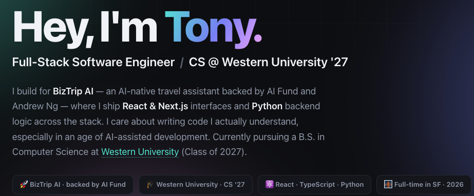

# Portfolio Builder

This repo contains some AI prompts/skills for generating a "personal portfolio" website.

A portfolio site is a great way to showcase your work, experience, and interests to potential employers.

## Examples

See the sites this produces, hosted live on GitHub Pages:

**→ [scottpersinger.github.io/portfolio-builder/examples](https://scottpersinger.github.io/portfolio-builder/examples/)**

Each example is a single, self-contained page built from a LinkedIn profile.

## Claude code skills

The easiest way to create your portfolio is to use **Claude code**.

- **[`create_portfolio`](./create_portfolio)** — builds an engaging, single-page
  portfolio from a LinkedIn profile (and/or existing personal site): hero, work
  experience with company logos, projects with images/demos, an Education section
  with standout coursework, and a contact section. Generates one self-contained
  HTML file and previews it in the browser.
- **[`deploy-to-github`](./deploy-to-github)** — publishes the generated site to
  GitHub Pages and returns a live HTTPS URL (creates/reuses a repo, enables Pages,
  verifies it's actually reachable). Used to host the examples above.

**Important:** install and set up the [Claude-in-Chrome](https://chromewebstore.google.com/publisher/anthropic/u308d63ea0533efcf7ba778ad42da7390?pli=1)
extension. This lets Claude read web pages, which is critical for gathering your
portfolio information. The Chrome DevTools extension can work too. Claude also uses
the extension to visually test your portfolio as it creates it.

## Hosting your portfolio

The portfolio is a folder of static HTML/CSS/image files, so it can be hosted
anywhere that serves static assets. The easiest free option is **GitHub Pages** —
just ask Claude to run the [`deploy-to-github`](./deploy-to-github) skill and it
will publish the site and hand you a public link.
